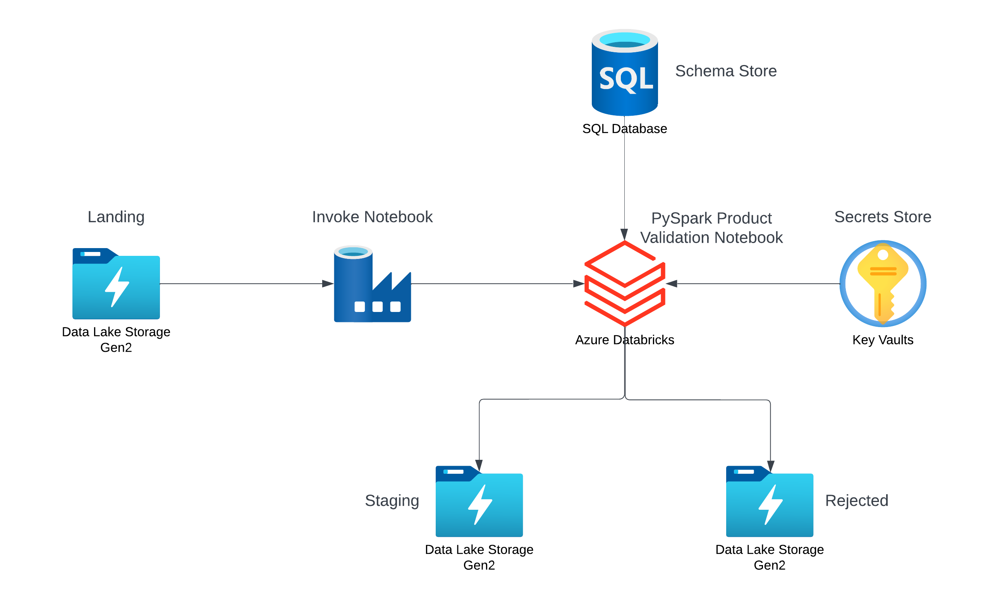

# Product Data Validation
Validate product data using Azure Databricks, Azure Datalake Gen2, Azure Data Factory, Azure Key Vault and Azure SQL Database

## Architecture

## Acknowlegdements
Course: 2 Real World Azure Data Engineer Project End to End - https://www.udemy.com/course/two-real-world-azure-data-engineer-projects-end-to-end/ 
Author: Deepak Goyal